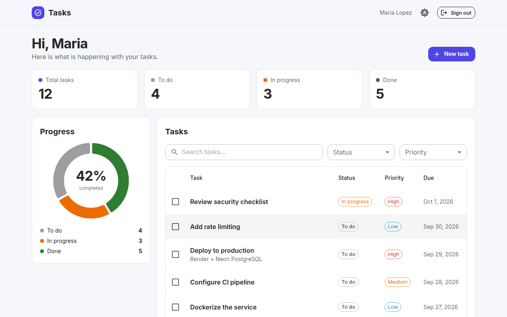
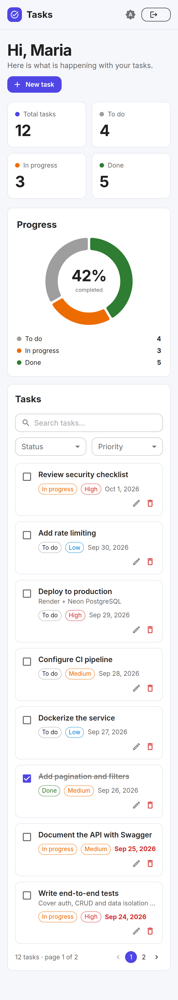
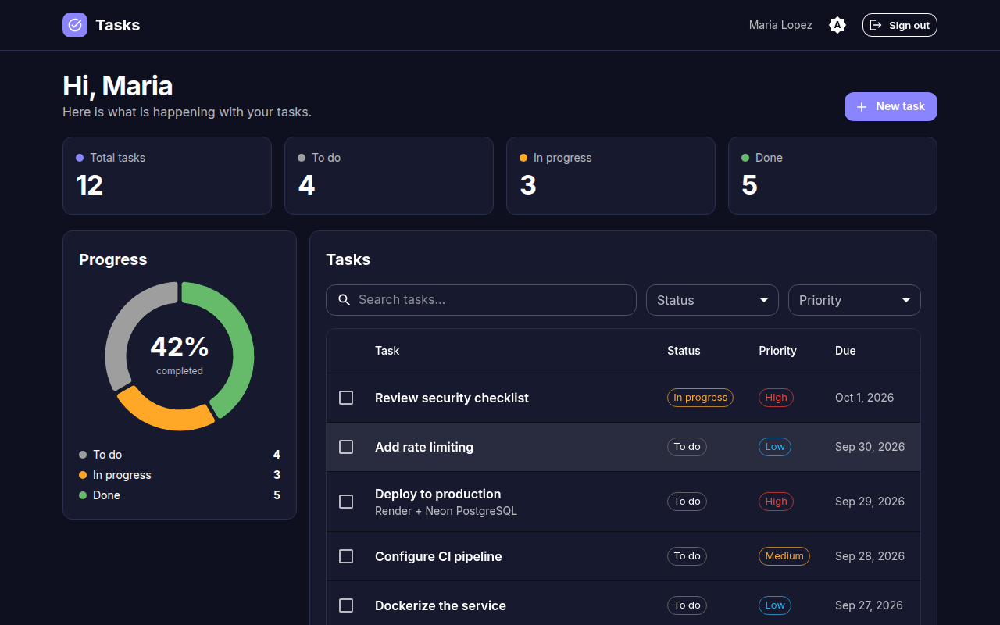

# Tasks Dashboard

A responsive task management dashboard built with **Next.js 15 (App Router)**, **React 19** and **TypeScript**, styled with **Tailwind CSS** and **Material UI**. It consumes the [Task Manager API](https://github.com/WilliamFFO/task-manager-api) and covers the full flow: real account registration, live statistics, a progress chart, search, filters, pagination and task CRUD.



## Features

- Account registration and sign-in against a JWT-protected API backed by a cloud PostgreSQL database (no test user needed)
- Summary cards and a donut chart (MUI X Charts) with the completion rate
- Task table with debounced text search, status and priority filters, and server-side pagination
- Create, edit, complete (optimistic checkbox) and delete tasks, with a confirmation dialog and toast feedback
- Overdue tasks highlighted; completed tasks struck through
- Responsive layout: a table on tablets and desktops, cards on phones (no horizontal scrolling)
- Light, dark and system themes with a toggle; the dark variant is shared by Tailwind and Material UI
- Friendly error handling: unreachable server, rate limiting, expired sessions (a `401` signs the user out)
- Accessible forms and dialogs: labels, focus management, keyboard support and descriptive `aria-label`s
- Unit and component tests with Vitest and Testing Library

| Mobile | Dark |
| --- | --- |
|  |  |

## Tech stack

Next.js 15 · React 19 · TypeScript · Material UI 7 · MUI X Charts · Tailwind CSS 4 · Vitest · Testing Library · ESLint · GitHub Actions

### How Tailwind and Material UI work together

Material UI provides the interactive components (dialogs, selects, tables, chips, tabs, snackbars) and the theme. Tailwind handles page layout, spacing and responsive behaviour. To make Tailwind utilities always win over component styles, the CSS layers are ordered as `theme, base, mui, components, utilities` in `src/app/globals.css`, and Material UI is rendered inside `@layer mui` with `enableCssLayer`. Tailwind's `dark:` variant is bound to the same `.dark` class that Material UI toggles on `<html>`.

## Getting started

1. Start the API (see its README). It uses a local SQLite file by default, or your cloud database when `DATABASE_URL` is set:

   ```bash
   cd ../task-manager-api
   npm install && npm run start:dev
   ```

2. Start the dashboard:

   ```bash
   cd tasks-dashboard
   npm install
   cp .env.example .env.local
   npm run dev -- -p 3001
   ```

3. Open `http://localhost:3001`, choose **Create account** and start using it.

### Configuration

| Variable | Default | Description |
| --- | --- | --- |
| `NEXT_PUBLIC_API_URL` | `http://localhost:3000` | Base URL of the Task Manager API |
| `NEXT_PUBLIC_DEMO_HINT` | `false` | Shows a demo account hint on the login page when `true` |

If the login shows "Could not reach the server", the API is not running or `NEXT_PUBLIC_API_URL` points to the wrong address. If the API runs on another origin, set `CORS_ORIGIN` on the API to the dashboard URL.

## Scripts

```bash
npm run dev         # development server
npm run build       # production build
npm start           # run the production build
npm run lint        # ESLint
npm test            # unit and component tests (Vitest)
```

## Project structure

```
src/
  app/
    (auth)/login/       sign in / create account
    (app)/              authenticated area: layout with header and route guard
    (app)/page.tsx      dashboard (stats, chart, filters, table, dialogs)
    layout.tsx          fonts, colour scheme script, MUI cache and providers
    globals.css         Tailwind, layer order and dark variant
  components/           header, stat cards, chart, filters, table, dialogs, login form
  lib/
    api.ts              typed API client with friendly errors
    auth.tsx            session context (localStorage)
    useTasks.ts         data loading, filters, pagination and mutations
    theme.ts            Material UI theme (light and dark)
tests/                  Vitest tests
```

## Deploy

On Vercel, import the repository and set `NEXT_PUBLIC_API_URL` to the URL of your deployed API. Then set the API's `CORS_ORIGIN` to the URL Vercel gives you.

## License

MIT
